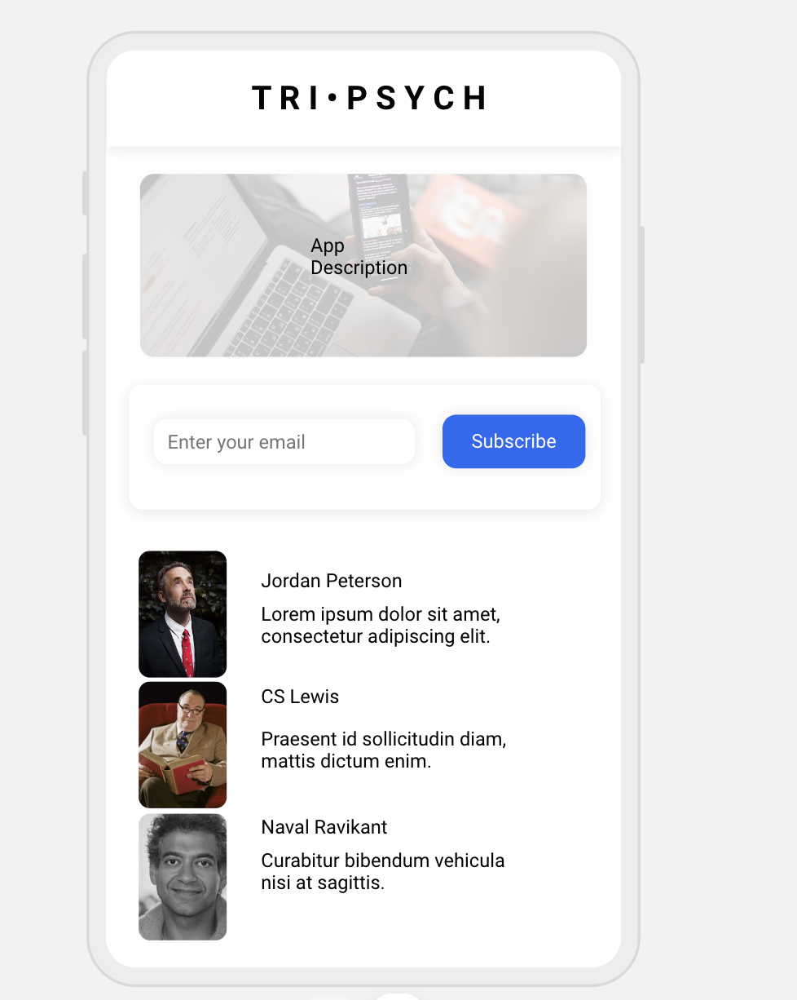

# Psych Bite

A service that emails a random quote from either Dr. Jordan Peterson, C.S Lewis or Naval Ravikant everyday at 7am to start your morning with a bite of knowledge.
- Working on this project: Vinny Vilasboa & Lucas Carlos


# WireFrame


## Installation

Use the package manager [NPM](https://www.npmjs.com/) to install.

```
npm install
```

```
npm i node-schedule nodemailer dotenv pm2 http-server
```

## Usage

```Run
# Run App: pm2 start index.js
# Run Front End: http-server
# Restart App: pm2 restart index.js
# App Log: pm2 logs 
# Side note: you can check if app is running by checking log
```

## Contributing

Pull requests are welcome. For major changes, please open an issue first
to discuss what you would like to change.

Please make sure to update tests as appropriate.
